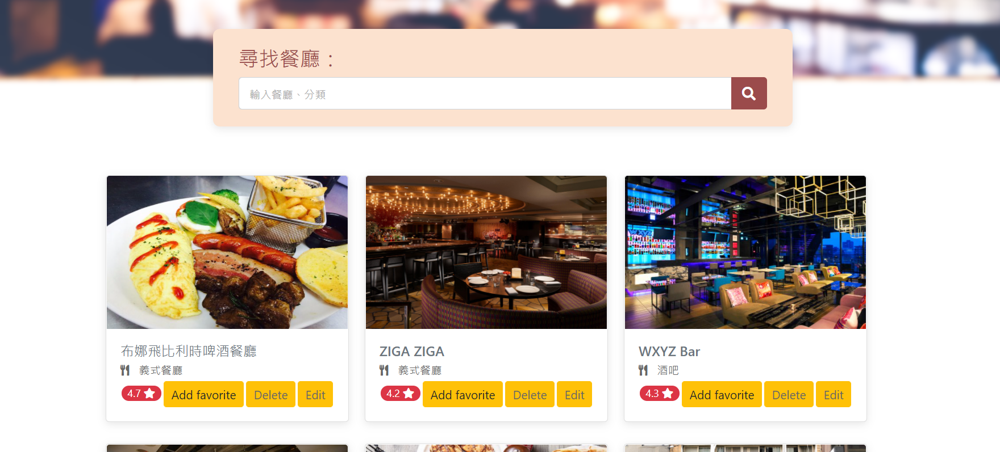
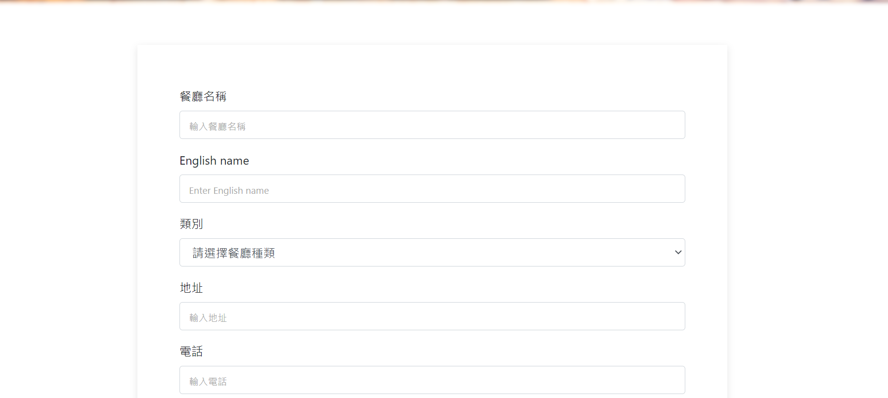
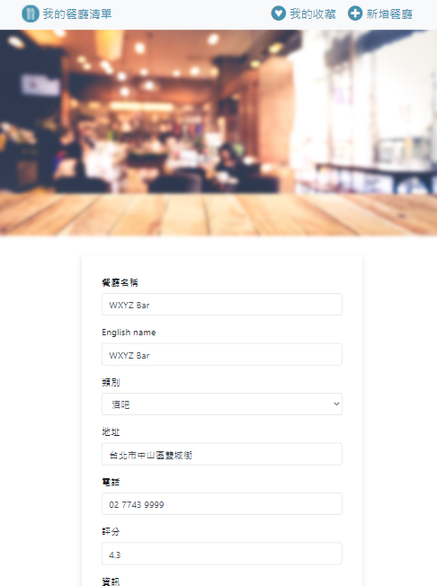

#Restaurant List
A website that you can manage your restaurants' data by Create / Edit / Delete.

## Features
- Render restaurant list from data base by MongoDB
- Browse each restaurant detailed info 
- Edit and revise the detailed info of each restaurant
- Delete the restaurant from your list
- Provide the restaurant info and add that to your list

## Preview
### 首頁 1

### 首頁 2

### 新增餐廳頁面

### 餐廳資訊業面

### 餐廳修改介面

## Environment and Requirements
- [node.js: v10.15.0](https://nodejs.org/en/)
- [MongoDB: v4.4.6](https://www.mongodb.com/try/download/community)

## Getting started

### Download files
    git clone https://github.com/ShinJustinHolly3317/Restaurant-List.git
### Go to directory
    cd restaurant/
### Install dependencies
    npm install
### Run seeder to create basic data
    npm run seeder
### Start server
    npm run start
### Connect to server
Use local host url to connect to server

    http://localhost:3000
